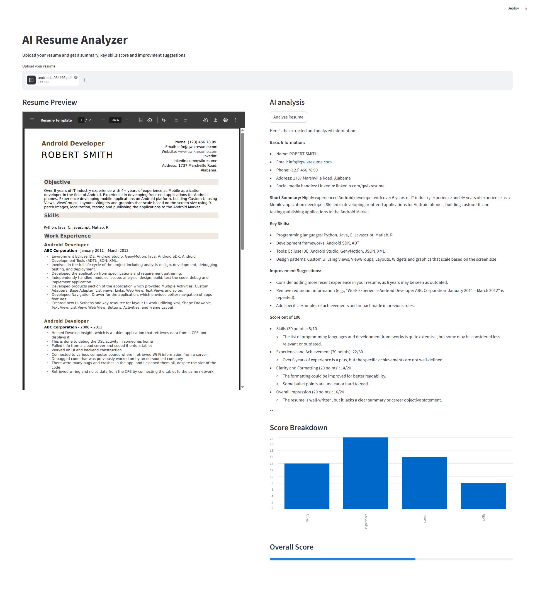
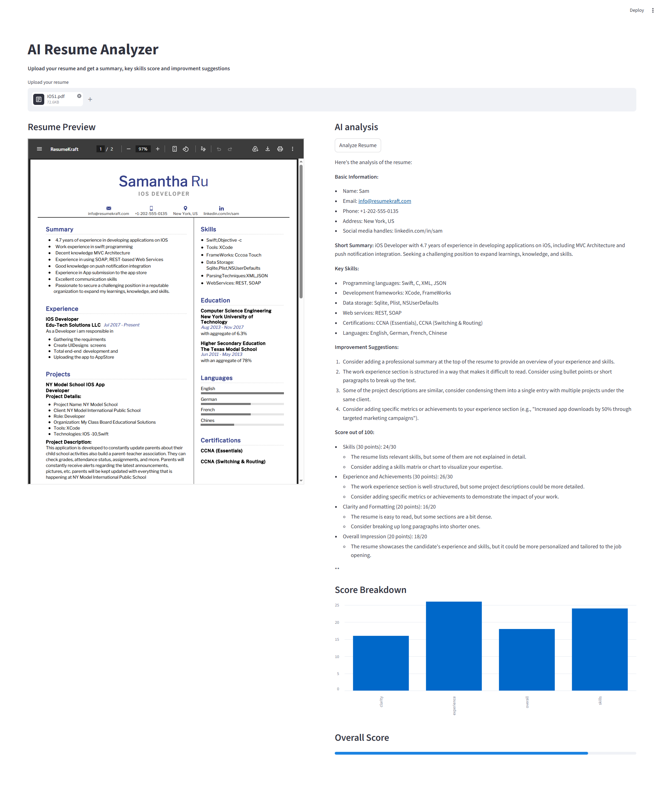

# AI Resume Analyzer

A Streamlit application that analyzes and scores resumes using AI.

## Overview

This is an interactive web application built with Streamlit. It allows users to upload their resume in PDF format, which will then be analyzed and scored based on various criteria such as skills, experience, clarity, and overall impression.

## Features

- **Resume Analysis**: Upload your resume to get a summary, key skills score, and improvement suggestions.
- **AI-powered Scoring**: The application uses a machine learning model to analyze the resume and provide scores based on different categories.
- **Interactive UI**: Users can easily navigate through the application and view their analysis results.

## Requirements

- Python 3.8+
- Streamlit
- Pymupdf (fitz library)
- Pandas
- Base64
- JSON
- Ollama

## How to Use

1. Clone this repository or download it as a zip file.
2. Install all required dependencies by running `pip install -r requirements.txt`.
3. Run the application using `streamlit run app.py`.
4. Upload your resume in PDF format and click "Analyze Resume" to get your analysis results.

Make sure you have ollama installed in your system to run this locally or use the **Open AI API** by changing the ollama part of the code.

## Contributing

Contributions are welcome! If you'd like to contribute to this project, please fork this repository, make your changes, and submit a pull request.

## Credits

- Streamlit
- Pymupdf (fitz library)
- Pandas
- Base64
- JSON
- Ollama
